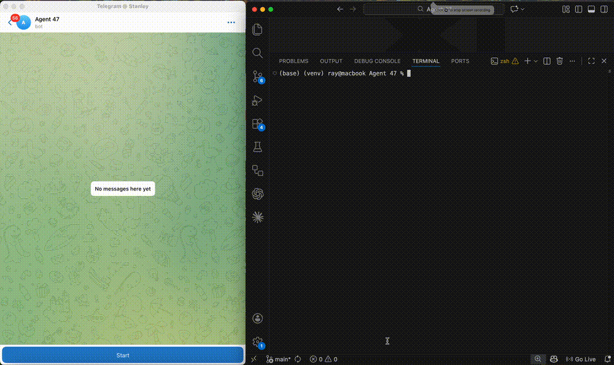
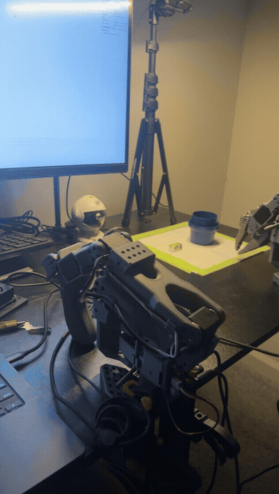

# Agent 47 — My Personal AI Agent

A personal AI agent that started as a text-based assistant and is progressively gaining senses and physical presence. It runs on a Mac, connects via Telegram, and is being extended — step by step — with real hardware: a perception camera, a depth sensor, and now a robot arm that can pick up and place objects on command.

Built from scratch to understand how agentic AI, the Model Context Protocol, and embodied robotics intersect.



---

## The story so far

**Stage 1 — Software agent.** Agent 47 started as a Claude-powered loop with MCP tool servers: file ops, GitHub, Brave Search, Gmail, and a self-extension mechanism that lets the agent write and register new tools at runtime. A Haiku-based intent classifier routes each turn to only the relevant tool servers, cutting input token cost by ~70%.

**Stage 2 — Eyes.** An NVIDIA Jetson Orin Nano on the local network runs a FastAPI perception server with an Intel RealSense D435I. The agent can call `capture_scene` any time to get a live JPEG and centre-depth reading — from the terminal or from a Telegram message on a phone.

**Stage 3 — Hands.** A SO-ARM101 robot arm, trained using imitation learning (Action Chunking Transformer), can pick up objects and drop them in a target bin. 24 teleoperated demonstrations, trained overnight on an M4 Pro with LeRobot. Evaluated at **5/5 successful pick-and-place runs**.



**Stage 4 (in progress) — Unified.** The trained policy gets wrapped as an `execute_manipulation` MCP tool — same pattern as `capture_scene` — so a single Telegram message can trigger: see workspace → move arm → confirm result → reply with before/after photos.

---

## What it can do right now

```
"Analyse the CSV in my workspace and show me the key trends"
"Read my README, check git diff, rewrite it, and push to GitHub"
"Search GitHub for open issues in my repo"
"Search the web for the latest AI research and summarise it"
"What are my most recent emails about?"
"What do you see in front of the camera?"   ← live RealSense capture
```

If it needs a tool it doesn't have, it writes it, registers it, and uses it — all in the same turn. Those tools persist across restarts.

---

## Interfaces

| Interface | How to run | Use case |
|---|---|---|
| Terminal | `python main.py` | Development, debugging |
| Telegram | starts with `main.py` | Phone access, anywhere |

Both share the same history, tools, and cost tracking — one process, one session.

---

## Architecture

```
You (terminal or Telegram)
        │
        ▼
┌─────────────────────┐
│   Interface Layer    │
│  main.py / Telegram  │
└──────────┬──────────┘
           │
           ▼
┌──────────────────────────────────────────┐
│            Agent Loop                     │
│                                           │
│  1. Haiku classifier → which servers?    │
│  2. Fetch only relevant tool schemas     │
│  3. Claude plans → tools execute         │
│  4. Track tokens + cost per turn         │
└──┬──────────┬──────────┬────────────┬───┘
   │          │          │            │
   ▼          ▼          ▼            ▼
Local MCP  GitHub MCP  Brave MCP  Gmail MCP
file ops   repos       web search  read/send
git tools  issues      images
dynamic    PRs
tools      search

           + Hardware MCP (local network)
           ┌─────────────────────────────┐
           │  capture_scene              │
           │  → Orin Nano → RealSense    │
           │                             │
           │  execute_manipulation (WIP) │
           │  → ACT policy → SO-ARM101   │
           └─────────────────────────────┘
```

### Intent-based tool routing

Every turn, a cheap Haiku classifier decides which MCP servers are actually needed before the main Sonnet call. A simple "hi" only loads local tools (~20 schemas) instead of all servers (~85 schemas).

### Self-extension

```
User asks for something
    ↓
Tool missing? → create_tool → writes Python → registers live
    ↓
Calls the new tool immediately — saved to disk, available forever
```

---

## Robot arm — how it was built

The manipulation capability was built over two weeks:

- **Hardware**: SO-ARM101 6-DOF arm (PartaBot kit), Waveshare BusLinker servo bus, 1080p top-down webcam
- **Teleoperation**: leader-follower control via LeRobot at 60 Hz, with rerun.io visualiser
- **Dataset**: 24 clean episodes of pick-and-place (`raystanlee/pick_object_drop_blue_bin`), ~750 frames each at 30 FPS
- **Training**: ACT policy (ResNet-18 backbone, VAE encoder, chunk size 100), trained with MPS backend on M4 Pro overnight. Final L1 loss: 0.045
- **Evaluation**: custom `robot/evaluate.py` (workaround for LeRobot issue #2597), 30 Hz control loop. Result: **5 / 5 episodes successful**

---

## Setup

**1. Clone and activate venv:**
```bash
cd "Agent 47"
python -m venv venv
source venv/bin/activate
pip install -r requirements.txt
```

**2. Add API keys to `.env`:**
```
ANTHROPIC_API_KEY=sk-ant-...
GITHUB_TOKEN=ghp_...
BRAVE_API_KEY=BSA...
TELEGRAM_TOKEN=...
TELEGRAM_USER_ID=...
```

**3. Set workspace folders in `config.py`:**
```python
SAFE_ROOTS = [
    Path("/Users/you/Agent 47").resolve(),
    Path("/Users/you/AgentWorkspace").resolve(),
]
```

**4. Configure MCP servers in `mcp.json`:**
```json
{
  "mcpServers": {
    "github": {
      "type": "http",
      "url": "https://api.githubcopilot.com/mcp/",
      "headers": { "Authorization": "Bearer ${GITHUB_TOKEN}" }
    },
    "brave": {
      "type": "stdio",
      "command": "npx",
      "args": ["-y", "@brave/brave-search-mcp-server"],
      "env": { "BRAVE_API_KEY": "${BRAVE_API_KEY}" }
    }
  }
}
```

**5. Run:**
```bash
python main.py
```

For robotics work, use the `lerobot` conda env and source `.env` before running anything in `robot/`.

---

## Project structure

```
Agent 47/
├── main.py               # Entry point — terminal + Telegram bot
├── config.py             # Settings and system prompt
├── AGENTS.md             # Project instructions and conventions
├── agent/
│   ├── loop.py           # Agentic loop + classifier + tool routing
│   └── pretty.py         # Coloured terminal output
├── mcp_server/
│   ├── server.py         # Local MCP server
│   ├── tool_store.py     # Dynamic tool persistence
│   └── dynamic_tools/    # Agent-created tools (auto-generated)
├── tools/
│   ├── handlers.py       # Built-in tool implementations
│   └── __init__.py       # Tool registry
├── safety/
│   └── sandbox.py        # Path sandboxing
├── memory/
│   ├── history.py        # Conversation persistence + auto-summarisation
│   └── usage.py          # Token and cost tracking
└── robot/
    ├── CONTEXT.md        # Hardware details, dataset paths, gotchas
    ├── evaluate.py       # ACT policy evaluation — runs N episodes on the arm
    └── manipulation_tool.py  # MCP tool wrapping ACTPolicy (in progress)
```

---

## Built-in tools

| Tool | What it does |
|---|---|
| `list_files` | List folder contents |
| `read_file` | Read a text file (capped at 8k chars) |
| `write_file` | Write or create a file |
| `delete_file` | Delete a file or folder |
| `create_folder` | Create nested folders |
| `move_file` / `rename_file` | Move or rename |
| `find_files` | Recursive glob search across all safe roots |
| `open_file` | Open with macOS default app |
| `git_status` / `git_diff` | Git inspection |
| `execute_python` | Run Python in a sandboxed subprocess |
| `create_tool` | Write and register a new tool at runtime |
| `capture_scene` | Live JPEG + depth from RealSense on Orin Nano |
| `execute_manipulation` | Run ACT policy on SO-ARM101 *(in progress)* |

Plus all tools from GitHub, Brave Search, and Gmail MCP servers.

---

## Cost tracking

Every session prints a breakdown on exit — API calls, tokens, estimated cost, most expensive turns. Pricing: Claude Sonnet 4.6 at $3/M input, $15/M output. The Haiku classifier runs at ~$0.001/M input — nearly free.

---

## Roadmap

- [x] Local file management via MCP
- [x] Multi-server MCP (GitHub, Brave, Gmail)
- [x] Dynamic tool creation at runtime
- [x] Intent-based tool routing — 70% token reduction
- [x] Telegram bot — phone access
- [x] Token + cost tracking
- [x] Hardware perception — Orin Nano + RealSense (`capture_scene`)
- [x] Robot arm — SO-ARM101 teleoperation, ACT training, 5/5 eval success
- [ ] `execute_manipulation` MCP tool — arm as agent actuator
- [ ] End-to-end demo: Telegram message → see → manipulate → reply with photos
- [ ] Scheduled / proactive tasks
- [ ] Voice interface
